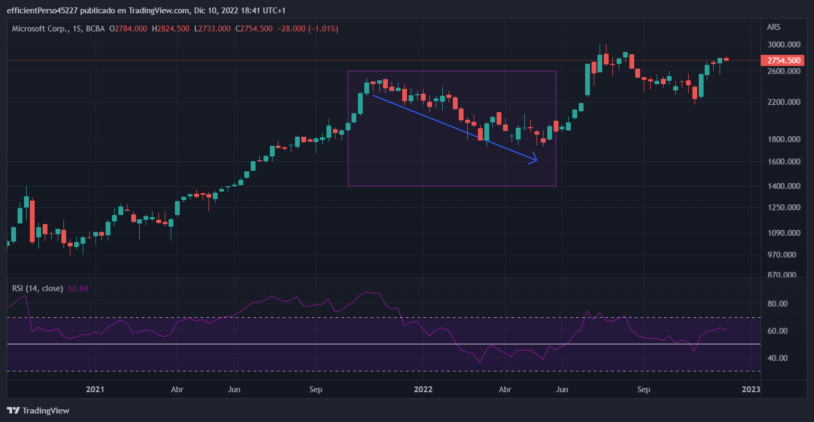

```{r setup, include=FALSE}
knitr::opts_chunk$set(echo = TRUE)
options(scipen = 9999)
```

## Introducción

El bono soberano GD30 es el activo de renta fija más operado en la Argentina en los últimos tiempos.
Este bono global de la República Argentina se caracteriza por ser el más utilizado para hacer una operación que resulta en la compra de divisas, conocidad como dolar MEP o Cable.
La posibilidad de comprar el bono GD30 en pesos y venderlo como GD30D (MEP) o GD30C (Cable) para hacerse de dólares evitando cualquier límite regulatorio, popularizó su uso entre un enorme porcentaje de los operadores del mercado argentino, desde pequeños y medianos ahorritas hasta grandes empresas.
De hecho, dado que el pago de intereses por la tenencia de este bono es muy bajo (así como muchos economistas descuentan que el bono será reestructurado a la brevedad), prácticamente el único incentivo que presenta la compra o tenencia de este bono es hacerse de dólares.
Esta gran participación de usuarios del mercado y su volumen diario lo hacen uno de los más representativos del mercado de bonos local.

El volumen se refiere a la cantidad de unidades nominales de un activo que se han intercambiado, generalmente, a lo largo de un día.
Si compramos 100 unidades nominales de un bono y vendemos 200, el volumen sería de 300 bonos, independientemente de su valor expresado en moneda.

En este trabajo, se busca observar el comportamiento de ese volumen operado, tratando de entender sus componentes como una serie temporal, explorando si hay estacionalidad en sus movimientos y evaluando técnicas de predicción en el tiempo.

Para esto, vemos a trabajar con dos tipos de modelos:

-   ARIMA
-   Prophet

## Datos y librerías

Los datos del volumen operado de un bono se pueden obtener de la mayoría de las páginas webs de las sociedades bursátiles argentinas.
En este caso, se obtiene un .csv de la web de [Rava Bursátil](https://www.rava.com/perfil/gd30) con los datos de cotización y volumen negociado del bono para cada día desde su emisión.

Para el procesamiento de datos y el análisis de la serie de tiempo, se utilizan las siguientes librerías:

```{r librerias, warning=FALSE, message=FALSE}
library(dplyr)
library(ggplot2)
library(prophet)
library(lubridate)
library(tsibble)
library(forecast)
library(feasts)
library(tidymodels)
library(modeltime)
library(fabletools)
library(fable)
library(cowplot)
library(reactable)
```

## ARIMA

ARIMA es un modelo estadístico utilizado para analizar y modelar series de tiempo.
Sus siglas corresponden a "Autoregressive Integrated Moving Average" y, como lo indica su nombre, pertenece a la familia de los modelos autoregresivos.
La autoregresión y la media móvil son los dos componentes que se utilizan para modelar una serie de tiempo en un modelo ARMA, pero la "I" de ARIMA corresponde a un tercer componente de "integración".

-   **Autoregresión**: es el componente que apunta a que se puede formular una regresión (similar a un modelo lineal generalizado, pero no propiamente) que permita predecir el valor presente o futuro de una variable dependiente en función de sus propios valores anteriores.
-   **Integración**: es una operación de "diferenciación", que se lleva adelante para convertir a las series en estacionarias (es decir, con una media y varianza constante).
    La diferenciación consiste en restar el valor de un punto de la serie de tiempo en un momento dado con el valor de la serie de tiempo en un momento anterior. Esta operación se puede realizar una o más veces, dependiendo de los valores de la serie de tiempo y de la complejidad que se quiera imprimir al modelo.\
    La diferencia entre ARMA y ARIMA radica en esta integración, que permite mejorar la capacidad predictiva del modelo ante series de tiempo con tendencia y con variaciones no lineales; eliminando la tendencia y haciendo de la serie una estacionaria.
-   **Media móvil**: es la forma de calcular el promedio sobre una cierta cantidad de valores pasados de la variable en cuestión.

## Prophet

Por su parte, Prophet es un modelo desarrollado por la empresa Facebook y pertenece a la familia de los modelos aditivos generalizados (GAM).
Una de las ventajas que presenta Prophet es que permite incluir en el modelado la detección de anomalías en la serie de tiempo, para controlar eventos inesperados.

Esto se debe a que Prophet también permite hacer una descomposición de la serie de tiempo en términos aditivos, considerando la estacionalidad del fenómeno en diferentes niveles de tiempo, así como obtener la tendencia general, el componente de eventos espaciones y el componente de error.

## Descomposición de la serie de tiempo

Una serie de tiempo se puede descomponer según un modelo de cuatro elementos:

-   **Tendencia general**.
    Se trata del patrón de más largo plazo de una serie temporal, suele tener un comportamiento suavizado y sus cambios son lentos.

-   **Variación estacional**.
    Son los patrones repetitivos y regulares en la serie de tiempo.
    Pueden observarse en perídoso del año o en ciclos más cortos como meses.

-   **Ciclos**.
    Son tendencias de mediano plazo, que se denomina como movimientos cíclicos.
    Son cambios periódicos a lo largo del tiempo, pero en un período no fijo.
    De hecho, una variación estacional puede ir en sentido contrario al de una tendencia general.

Una buena forma de visualizar esto es a partir del análisis de gráficos de acciones:




Aquí se puede aprecar cómo la acción de Microsoft tiene una clara tendencia general positiva (o "alcista"), pero desde fines de 2021 hasta mediados de 2022 se observa un claro ciclo bajista

-   **Ruido random**. Se trata de las fluctuaciones impredecibles, lo que no tiene un patrón claro en la serie de tiempo.

Tres de estos componentes se expresan en la descomposición que se puede hacer de una serie de tiempo con la función `decompose()`.

```{r}

data <- read.csv('C:/Users/lisan/OneDrive/Escritorio/MAESTRIA/EEA/TP-2/eea/TP-2/bono.csv') %>%
  select(ds = fecha, y = volumen) %>% 
  mutate(ds = as.Date(ds)) %>% 
  filter(ds > '2020-10-01' & ds < '2022-12-01') %>% 
  group_by(ds = floor_date(ds, unit = "week")) %>% 
  summarise(y = mean(y, na.rm = TRUE)) %>% 
  as_tsibble(index = ds)

```

```{r}

plot(decompose(ts(data$y, frequency = 52)))

```

En este caso, se puede observar una clara tendencia alcista, con patrones estacionales muy cambiantes.

## Análisis exploratorio

### Linealidad

Como se expresó anteriormente, la incorporación del componente de integración de ARIMA permite mejorar la capacidad predictiva ante series de tiempo con patrones de variación no lineales.
Para evaluar si una serie de tiempo muestra o no patrones lineales en su comportamiento, una primer forma de aproximación es mediante la exploración visual.

Un patrón de variación no lineal se refiere a un patrón de cambio en los valores de la serie de tiempo que no es lineal, es decir, que no puede ser representado por una línea recta en un gráfico.

```{r grafico uno}
autoplot(data) 
```

Si bien una primera aproximación visual permite ver que no hay una linealidad muy marcada y que, por el contrario, a mitad de 2022 se ve un salto importante en el comportamiento de la serie temporal (correspondiente con un momento de alta inestabilidad política, dada la renuncia del entonces ministro de Economía, Martín Guzmán), esta visualización no es estrictamente suficiente para corrobonar la linealidad o no de la serie.
Como se verá más adelante, este cambio brusco puede beneficiar a Prophet en términos de su capacidad predictiva.
Una aproximación más estadística para este problema se puede realizar a partir de la autocorrelación.

### Autocorrelación: tenencia y estacionalidad

La autocorrelación es una medida estadística que se utiliza para evaluar la relación entre los valores de una serie de tiempo y los diferentes puntos en el tiempo.

Los valores de una serie temporal está correlacionada con valores anteriores.
Si no existe ningún tipo de correlación, entonces fenómeno no puede ser modelado como una serie de tiempo.
\
Un valor de autocorrelación cercano a 1, indica una alta correlación entre los valores de la seriede tiempo; mietras que un valor cercano a 0 indica baja correlacióny un posible patrón lineal.

```{r autocorrelacion}
acf(data,type = "correlation", na.action = na.pass )
```

Cuando los datos tienen una **tendencia**, las autocorrelaciones para pequeños retrasos tienden a ser grandes y positivas: esto implica que las **observaciones más cercanas entre sí tienen valores muy parecidos**.
Esto se expresa claramente en el gráfico de autocorrelación: mientras en la descomposición de la serie de tiempo ya habíamos visto una tendencia positiva, aquí podemos corrobarar que hay una autocorrelación entre los valores más cercanos entre sí, haciéndolos parecidos a los valores más cercanos y reduciendo la "influencia" de los valores más lejanos en el tiempo.
Por otro lado, los valores que se encuentran por encima de la línea superior punteada señalan que estos lags tienen una autocorrelación estadísticamente significativa.

Si bien queda claramente visualizada la tendencia positiva y su efecto en la autocorrelación, también se puede apreciar un leve aumento de la correlación en torno al lag de nivel 10.
Esto se podría llegar a explicarse por la presencia de un cierto nivel de **estacionalidad**.
Una serie de tiempo **es estacionaria si sus propiedades estadísticas, como su media y su varianza, no cambian con el tiempo.** Esto es importante porque una serie de tiempo estacionaria es más fácil de modelar.

Para evaluar esto, se realiza un gráfico estacional, en el que puede verse que hay un importante salto del volumen opreado en fechas entre los meses de noviembre y diciembre, así como en los meses de junio.

```{r}
data %>%
  gg_season(labels = "both", na.rm = TRUE) +
  labs(y = "Volumen", x = "Día",
       title = "Volumen operado GD30")

```

Si bien la exploración visual es de gran ayuda, también puede realizarse una análisis de la autocorrelación parcial (**PACF**) para determinar en mejor medida esta característica.

```{r}
pacf(data)
```

La aparición de valores por encima de la línea superior horizontal señala la posibilidad de que la serie de tiempo **tenga características no estacionarias**.

## Predicción

### ARIMA

Dado que vimos la no linealidad de la serie de tiempo, así como la presencia de una clara tendencia y un cierto comportamiento no estacionario, se utiliza un modelo ARIMA para hacer la primera predicción.
En este caso, utilizaremos las observaciones en su forma diaria y sus variables se procesarán para que sirvan tanto en el modelo ARIMA como en Prophet.

```{r}
data <- read.csv('C:/Users/lisan/OneDrive/Escritorio/MAESTRIA/EEA/TP-2/eea/TP-2/bono.csv') %>%
  select(ds = fecha, y = volumen) %>% 
  mutate(ds = as.Date(ds))
```

En el caso de ARIMA, se trabajará con las herramientas brindadas por la librería **tidymodels**.

La serie de tiempo será dividida en train y test con el objetivo de entrenar el modelo en unos datos y poder testear la capacidad predictiva en otras fechas con las que ya contamos.
Para esto, se utilizará la función `initial_time_split()`.

```{r}

splits_arima <- initial_time_split(
  data = data, 
  prop = 0.8)

```

Se entrena un modeo ARIMA apelando a la función `set_engine` de tidymodels.
Esto establece un "motor" del modelo como *auto_arima*, que realiza una búsqueda exhaustiva para encontrar el modelo ARIMA que mejor se ajusta a una serie de tiempo dada, sin tener que especificar manualmente los parámetros del modelo.
Esta función se basa a la vez en la función del mismo nombre del paquete **forecast**.

```{r}
arima <- arima_reg() %>% 
  set_engine('auto_arima') %>% 
  fit(y~ds, data = training(splits_arima))
```

Se calculan las métricas de performance del modelo ARIMA en base a la separación de datos y calibra el modelo para poder calcular la precisión y la confianza:

```{r}
arima_cal <- arima %>%
  modeltime_table() %>%
  modeltime_calibrate(new_data = testing(splits_arima))

resultados_arima <- arima_cal %>% 
            modeltime_accuracy()

reactable(resultados_arima)
```

Se visualizan los valores predichos

```{r}
arima_forecast <- arima_cal %>% 
  modeltime_forecast(
    new_data    = testing(splits_arima),
    actual_data = data
    )

reactable(arima_forecast)
```

```{r}
arima_forecast %>% 
  plot_modeltime_forecast(
    .legend_max_width = 30, 
    .interactive      = TRUE,
    .conf_interval_alpha = 0.2, 
    .line_size=0.2
    )
```

### Prophet

El otro modelo a evaluar será Prophet.
Dado que Prophet permite modelar **eventos especiales**, estos se agregan como un data.frame.
Las fechas que serán consideradas en este caso serán:

1.  Las PASO de 2021

2.  Las elecciones generales de 2021

3.  El acuerdo de renegociación de la deuda externa entre Argentina y el FMI

4.  La renuncia del ministro de Economía, Martín Guzmán

5.  La designación de Sergio Massa como ministro.

    Estas fechas no son las exactas, si no las correspondientes a la primera rueda de mercado posterior a cada uno de estos eventos. \

```{r}
eventos = data.frame(
  holiday= 'eventos',
  ds= ymd(c('2021-09-13','2021-11-15','2022-02-01',
                        '2022-07-04','2022-07-28')),
  lower_window= 0,
  upper_window= 0)

glimpse(eventos)
```

Se entrena el modelo Prophet con los eventos especiales, así como con una estacionalidad mensual, y se visualiza su ajuste.

```{r}
prophet= prophet(holidays = eventos)

prophet= add_seasonality(prophet, name='monthly', period=30.5, fourier.order = 4)

prophet = fit.prophet(m = prophet, data)
```

```{r}
plot(prophet, fcst = predict(prophet, data)) +
  theme_bw()
```

Como se dijo previamente, Prophet es un modelo de series de tiempo que permite modelar y analizar diferentes patrones en los datos de una serie de tiempo, incluyendo la **estacionalidad mensual**.

```{r}
prophet_plot_components(prophet, fcst=predict(prophet, data))
```

Como se planteó en la introducción de este trabajo, uno de los objetivos era evaluar la estacionalidad mensual de la serie de tiempo estudiada.
Este visualización de los componentes de Prophet permite visualizar un claro aumento del volumen operado de GD30 cuando se acerca el fin de mes.

Para evaluar la parte predictiva del modelo, se recurre a la función `cross_validation()` de Prophet.
Esta estructura de validación implica definir un período inicial de entrenamiento, un momento de corte (*cutoff*) y un horizonte de predicción hacia adelante.


Luego de establecer el primer fold, la fecha de corte se va moviendo hacia adelante.
El parámetro "period" es el que le indica a la función qué tan grande debe ser esa ventana de movimiento.

```{r}
cv_prophet = cross_validation(prophet, initial = 45, period = 7, horizon = 15, units = 'days')

reactable(cv_prophet)
```

Habiendo obtenido los resultados de `cross_validation`, se buscan las métricas de evaluación con la función `performance_metrics`.

```{r}
resultados_prophet <- performance_metrics(cv_prophet, rolling_window = 0.20)
reactable(resultados_prophet)
```

Más allá de las tablas, se puede observar el comportamiento de las métricas, visualizando cómo aumentan los errores a medida que el horizonte de predicción es más lejano.

```{r}
prophet_mae <- plot_cross_validation_metric(cv_prophet, metric = 'mae', 
                                            rolling_window = 0.20) +
              theme_bw() + 
              labs(title="Prophet: MAE")

prophet_rmse <- plot_cross_validation_metric(cv_prophet, metric = 'rmse', 
                                            rolling_window = 0.20) +
              theme_bw() + 
              labs(title="Prophet: RMSE")

cowplot::plot_grid(prophet_mae, prophet_rmse)

```

Así como también se puede visualizar interactivamente la predicción.

Puede verse claramente que la predicción de **Prophet es mucho más ajustada a los datos que la predicción de ARIMA**.

```{r}
dyplot.prophet(prophet, fcst=predict(prophet, data))

```

Finalmente, se resumen comparativamente los errores de cada uno de los modelos en la misma tabla.

```{r}
comparacion_arima <- resultados_arima %>% 
  mutate(modelo = "ARIMA") %>% 
  select(modelo, mae, rmse)

comparacion_prophet <- resultados_prophet %>%
  filter(horizon == 3 | horizon == 6 | horizon == 10) %>% 
  mutate(modelo = case_when(
    horizon == 3 ~ "Prophet 3 días",
    horizon == 6 ~ "Prophet 6 días",
    horizon == 10 ~ "Prophet 10 días"
  )) %>% 
  select(modelo, mae, rmse)

comparacion <- rbind(comparacion_arima, comparacion_prophet)

reactable(comparacion)
```

Se puede ver que el modelo de Prophet tiene errores considerablemente menores que en el caso del modelo ARIMA, mostrando mayor flexibilidad para ajustarse a datos complejos de muy corto plazo, pero con ARIMA mostrando una mejor captación general del proceso en períodos más prolongados.

## Extra

Dado que el valor más popular de lo que se conoce como dólar MEP se desprende de las operaciones de compra y venta del bono GD30, cabe preguntarse si la estacionalidad que presenta la operatoria de bonos en términos mensuales también se expresa en el valor del dólar resultante de esta operación.

Se obtienen los datos de cotización del dólar MEP para el mísmo período analizado en el caso del bono GD30.

```{r}
dolar <- read.csv('C:/Users/lisan/OneDrive/Escritorio/MAESTRIA/EEA/TP-2/eea/TP-2/dolar.csv') %>% 
  select(ds = fecha, y = ultimo) %>% 
  mutate(ds = as.Date(ds)) %>% 
  filter(ds > '2020-09-07' & ds < '2022-12-08')

```

Se evalúa su estacionalidad recurriendo a las funciones de Prophet.

```{r}
prophet_dolar= prophet(holidays = eventos)

prophet_dolar= add_seasonality(prophet_dolar, name='monthly', period=30.5, fourier.order = 4)

prophet_dolar = fit.prophet(m = prophet_dolar, dolar)

prophet_plot_components(prophet_dolar, fcst=predict(prophet_dolar, dolar))
```

#### Biblografía

-   Peter J. Brockwell & Richard A. Davis (1991) Time Series: Theory and Methods, 2nd edition

-   Hyndman, R.J., & Athanasopoulos, G.
    (2021) *Forecasting: principles and practice*, 3rd edition

-   Karina Bartolomé y Rafael Zambrano (2021) Múltiples modelos sobre múltiples series de tiempo: un enfoque tidy.
    [Link](https://karbartolome-blog.netlify.app/posts/seriestemporales/#modelo-prophet)

-   Fernando Campos (2018) Análisis de series de temporales en R, ARIMA. [Link](https://www.diegocalvo.es/analisis-de-series-temporales-en-r-arima/)

-   Librería Prophet.
    [Link](https://facebook.github.io/prophet/docs/diagnostics.html#cross-validation)

-   Juan Manuel Barriola, Azul Villanueva y Franco Mastelli (2022).
    GAM en series de tiempo: Prophet.
    [Github](https://eea-uba.github.io/EEA-2022/clase%2011/prophet_shopping.nb.html#Gr%C3%A1ficos)

-   Canal de Andrés Farral.
    [YouTube](https://www.youtube.com/@andresfarall9438)

